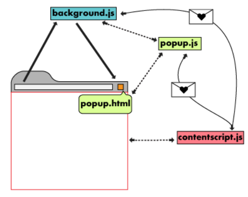

# Presentasjon: Easy CMS Populate
 
1. Om Google Chrome utvidelser 
2. Arkitektur: Easy CMS Populate 
3. Prosess: start til nåværende versjon 
4. Mulige forbedringer 
 

## 1. Om Google Chrome utvidelser

* Nødvendig: `manifest.json` (info og rettigheter). 
* Arkitektur: 

  

## 2. Arkitektur: Easy CMS Populate

### 2.1 Handlingssekvens

|  #  |      Handling      |  Konsekvens |
|----------|-------------|------|
| 1 |  Klikk på ikon | `popup.html` åpnes |
| 2 |  Klikk på skjemaknapp på `popup.html`   |  `popup.js` lytter og sender data til aktiv fane i Chrome |
| 3 |  |  `background.js` lytter til melding og sender data til `Google Sheets` med `Sheets API`    |
| 4 | | Brukeren autentiseres med `OAuth2` |
| 5 | | Regnearket fylles etter mal |
